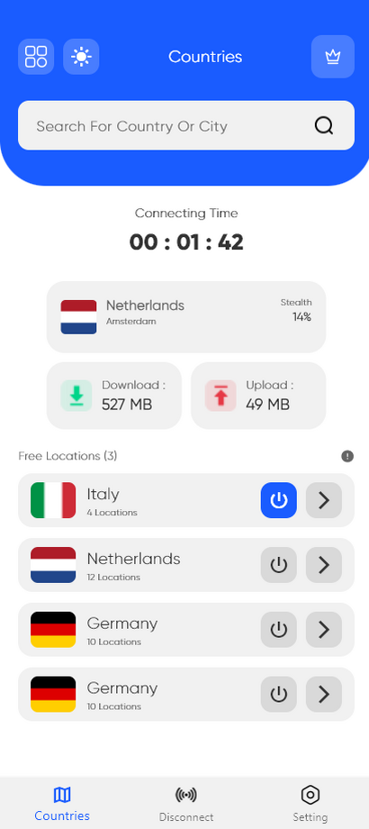
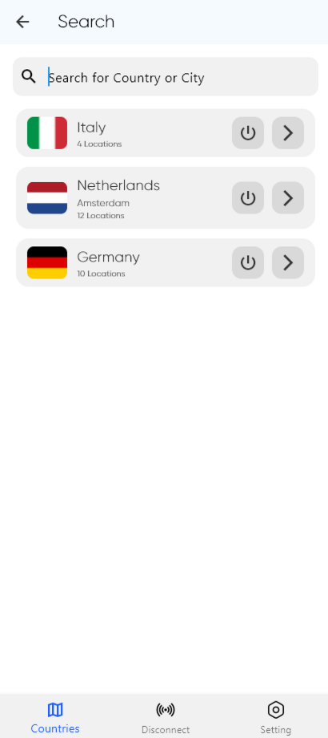
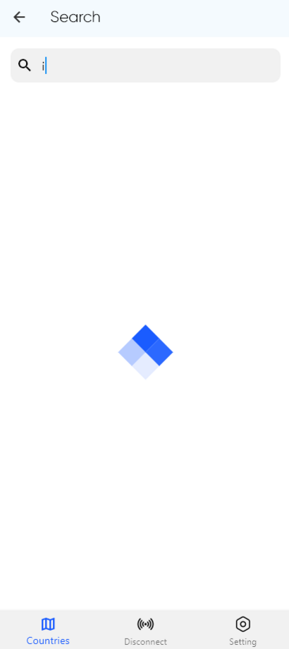

# 🌐 Flutter VPN App

Bu proje, Flutter ile geliştirilmiş, temel VPN uygulaması simülasyonudur. Uygulama, kullanıcıların farklı ülkelere bağlanmalarını, bağlantı istatistiklerini görüntülemelerini ve ücretsiz lokasyonlar arasında geçiş yapmalarını sağlar. Gerçek bir VPN altyapısı içermemekte olup, mock veriler üzerinden işlevsellik test edilmektedir.

---

## 📱 Ekran Görüntüleri
Ana Ekran | Ülke Seçim Ekranı | Arama Yükleniyor  
:-------------------------:|:-------------------------:|:-------------------------:  
 |  | 
---

## 🛠️ Kurulum

Projeyi yerel cihazınızda çalıştırmak için aşağıdaki adımları izleyin:

```bash
git clone https://github.com/melikebekta/VPN-App.git
cd VPN-App
flutter pub get
flutter run
```

---

## 🧱 Proje Yapısı ve Mimarisi

- **Mimari:** MVVM (Model-View-ViewModel)
- **Mock Data:** Gerçek bir VPN servis API’si yerine mock veriler kullanılmıştır.
- **UI:** Verilen tasarım görseline sadık kalınarak, modern ve kullanıcı dostu arayüz oluşturulmuştur.

---

## 🧩 Özellikler

### Genel Özellikler
- Seçilen ülkeye bağlanma ve bağlantıyı kesme
- Bağlantı süresi gösterimi (saat:dakika:saniye)
- İndirme ve yükleme hızı (MB)
- Sinyal gücü yüzdesi

### Ana Ekran
- Bağlantı durumu
- Ülke bilgisi (bayrak, şehir, sinyal gücü)
- İstatistik kartları
- Alt navigasyon menüsü

### Ülke Seçim
- Arama fonksiyonu
- Lokasyon sayısı gösterimi
- Bayraklarla ülke listesi

---

## 🎨 UI Gereksinimleri

- **Ana Renk:** `#1A5CFF` (Mavi)
- **Arka Plan:** `#F2F5F9` (Açık Gri)
- **Metin Renkleri:** `#FFFFFF`, `#333333`, `#666666`
- **Kart Yapısı:** Yuvarlak köşeli (12dp), hafif gölgeli

---
## 📁 Veri Modelleri

```dart
class CountryModel {
  final String name;
  final String flagCode;
  final String? city;
  final int locationCount;
  final int strength;
  final bool isConnected;
}

```

---

## 📦 Kullanılan Paketler

| Paket Adı | Açıklama |
|-----------|----------|
| `get` | GetX state management |
| `flutter_spinkit` | Yükleme animasyonu kütüphanesi|

---

## 📌 Notlar

> Bu proje gerçek bir VPN servisi sunmaz. Yalnızca frontend simülasyonu ve Flutter mimarisi üzerine kurgulanmıştır.

---

## 👩‍💻 Geliştirici

*Melike Bektaş*  
[](https://github.com/melikebekta)
[](https://www.linkedin.com/in/melike-bektas/)

---

## 📄 Lisans

Proje [MIT License](./LICENSE) altında yayınlanmaktadır.
